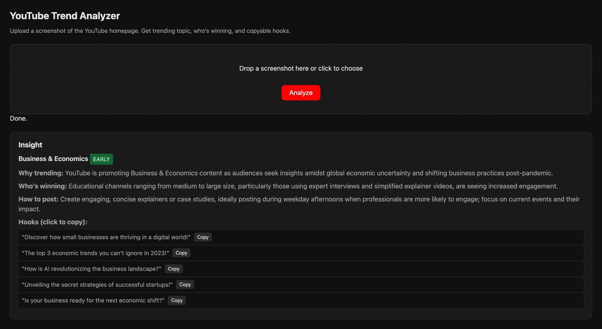

# TrendSignal

Upload a screenshot of the YouTube homepage → get **trending topic**, **why it’s trending**, **who’s winning**, **how to post**, and **5 copyable short-form hooks**. Built as a 2-day MVP: stateless, MCP-based, AI does all reasoning.

---

## Project layout

| Path | Role |
|------|------|
| **app/** | Application code: API, analysis pipeline, MCP server, static UI, system prompt. Also `app/requirements.txt`, `app/pyproject.toml`, `app/.env.example`. |
| **deploy/** | Deploy scripts and config: `Dockerfile`, `docker-compose.yml`, `.dockerignore`, `k8s/`, `vm/`. |
| **readme-assets/** | Images, demo video (`ai-yt-trend-analyser.mp4`), and assets used by this README. |
| **README.md** | This file: steps to run locally and deploy. |
| **.gitignore** | Repo root only; `.env` and copied `.dockerignore` are ignored. |

**Steps summary:** 1) Set up env: `cp app/.env.example .env` and set `OPENAI_API_KEY`. 2) Install deps: `pip install -r app/requirements.txt`. 3) Run app: Web UI + API → `python -m app.api`; MCP server → `python -m app.server`. 4) Deploy: Docker (copy `deploy/.dockerignore` to repo root first, then `docker compose -f deploy/docker-compose.yml up`); K8s → `deploy/k8s/README.md`; VM → `deploy/vm/README.md`.

---

## Input & output

**Input (image placeholder):** Screenshot of the YouTube homepage (recommended feed) — video grid with thumbnails, titles, channel names, view counts. Users drop this image in the upload area and click **Analyze**.

[Input: YouTube homepage screenshot](readme-assets/input-screenshot.png)

**Output (insight placeholder):** The analyzer returns one structured result: **topic** (e.g. Business & Economics), **trend strength** (EARLY | HEATING_UP | SATURATED), **why trending**, **who’s winning**, **how to post**, and **5 copyable hooks** with Copy buttons. Shown in the “Insight” section below the upload area.



To display the screenshots above, add `input-screenshot.png` (YouTube homepage) and `output-insight.png` (analyzer result) under `readme-assets/`. See `readme-assets/README.md`.

**Demo video:** *(embeds as a player when viewing this README on GitHub)*


---

## Architecture

```
┌─────────────────────────────────────────────────────────────────────────────┐
│                              TrendSignal                                    │
├─────────────────────────────────────────────────────────────────────────────┤
│                                                                             │
│   ┌──────────────┐     ┌───────────────────────────────────────────────┐    │
│   │   Browser    │     │              analysis.py (core)               │    │
│   │  (upload UI) │     │  ┌─────────┐  ┌─────────┐  ┌─────────┐        │    │
│   └──────┬───────┘     │  │ Vision  │→ │ Topics  │→ │Strength │→ ...   │    │
│          │             │  │ extract │  │ detect  │  │estimate │        │    │
│          │ POST        │  └────┬────┘  └────┬────┘  └────┬────┘        │    │
│          ▼             │       │            │            │             │    │
│   ┌──────────────┐     │       └────────────┴────────────┘             │    │
│   │   api.py     │─────┼───────────────────────────────────────────────┤    │
│   │  (FastAPI)   │     │  run_full_pipeline(image) → JSON insight      │    │
│   └──────┬───────┘     └───────────────────────────────────────────────┘    │
│          │                       ▲                                          │
│          │ :8001                 │ same core                                │
│          │                       │                                          │
│   ┌──────┴───────┐     ┌─────────┴────────────────────────────────────┐     │
│   │  server.py   │     │  MCP tools (vision_extract, trend_detect,    │     │
│   │  (MCP)       │─────│  trend_estimate_strength, creator_advice)    │     │
│   └──────────────┘     └──────────────────────────────────────────────┘     │
│          │ :8000/mcp                                                        │
│          ▼                                                                  │
│   Cursor / MCP client (orchestrator calls tools in order)                   │
│                                                                             │
└─────────────────────────────────────────────────────────────────────────────┘
                                    │
                                    ▼
                          OpenAI (vision + chat)
```

**Flow**

1. **Input:** Screenshot (image file or base64).
2. **Vision extract:** GPT-4o Vision reads the screenshot → list of videos (title, creator, views, hours_since_posted, emotional_tone).
3. **Topic detection:** Chat groups videos into dominant topics (topic_name, video_count).
4. **Strength estimate:** Chat estimates trend stage: EARLY | HEATING_UP | SATURATED.
5. **Creator advice:** Chat returns why_trending, who_is_winning, posting_advice, and 5 hooks.
6. **Output:** Single JSON: `topic`, `trend_strength`, `why_trending`, `who_is_winning`, `how_to_post`, `hooks`.

**Components**

| Layer        | Role |
|-------------|------|
| **app/analysis.py** | Core pipeline and helpers; used by both API and MCP. |
| **app/api.py**     | Web: upload UI + POST /analyze → runs full pipeline. |
| **app/server.py**  | MCP: exposes the same 4 steps as callable tools. |
| **OpenAI**         | Vision (screenshot → videos) and chat (topics, strength, advice). |

---

## Quick start

### 1. Environment

```bash
cd TrendSignal
cp app/.env.example .env
# Set OPENAI_API_KEY in .env
```

### 2. Install (pip + venv)

```bash
python3 -m venv .venv
source .venv/bin/activate   # Windows: .venv\Scripts\activate
pip install -r app/requirements.txt
```

*(Optional: if you have [uv](https://docs.astral.sh/uv/), run `uv sync` from the `app/` directory.)*

### 3. Run the upload UI + API

```bash
python -m app.api
```

Open **http://localhost:8001** → drop a YouTube homepage screenshot → **Analyze** → get topic, strength, why trending, who’s winning, how to post, and copyable hooks.

### 4. Run the MCP server (for Cursor)

```bash
python -m app.server
```

MCP endpoint: **http://localhost:8000/mcp** (streamable HTTP). Add this URL in Cursor (Settings → MCP) and use the system prompt in `app/SYSTEM_PROMPT.md` so the AI calls the tools in order.

---

## Deploy

### Docker (local)

1. **Create `.env`** in the repo root (e.g. `cp app/.env.example .env`) with `OPENAI_API_KEY=sk-your-key`.
2. **From repo root**, copy deploy ignore file so Docker uses it: `cp deploy/.dockerignore .`. Then build and run:
   ```bash
   docker build -f deploy/Dockerfile -t trend-signal .
   docker run -p 8001:8001 --env-file .env trend-signal
   ```
   Or with Compose (copy `deploy/.dockerignore` to repo root first so Docker uses it):
   ```bash
   cp deploy/.dockerignore .
   docker compose -f deploy/docker-compose.yml up --build
   ```
3. Open **http://localhost:8001**.

### Kubernetes (cloud)

1. **Create the secret** (do not commit the key):
   ```bash
   kubectl create secret generic trend-signal-secret \
     --from-literal=OPENAI_API_KEY=sk-your-key
   ```
2. **Push the image** to your registry and set `image` in `deploy/k8s/deployment.yaml`.
3. **Deploy:**
   ```bash
   kubectl apply -f deploy/k8s/deployment.yaml
   kubectl apply -f deploy/k8s/service.yaml
   ```
4. **Access:** `kubectl port-forward svc/trend-signal 8001:80` or use a LoadBalancer/Ingress. See **deploy/k8s/README.md** for Ingress and registry details.

### VM (Docker or Python)

- **Docker on VM:** Copy the project to the VM, create `.env` (e.g. `cp app/.env.example .env`), then from repo root:
  ```bash
  cp deploy/.dockerignore .
  docker build -f deploy/Dockerfile -t trend-signal .
  docker run -d -p 8001:8001 --env-file .env --restart unless-stopped trend-signal
  ```
- **Python on VM:** Install Python 3.11+, create venv, `pip install -r app/requirements.txt`, create `.env` (e.g. from `app/.env.example`), then `python -m app.api`.
- Full steps (systemd, firewall): **deploy/vm/README.md**.

---

## Cursor MCP setup

1. **Start the MCP server** (from repo root, venv activated):
   ```bash
   cd TrendSignal
   source .venv/bin/activate
   python -m app.server
   ```
2. **Add server in Cursor:** Settings → MCP → Streamable HTTP → `http://localhost:8000/mcp`.
3. **Use in chat:** Paste/attach a YouTube homepage screenshot and ask for trend insight and hooks; optionally paste `app/SYSTEM_PROMPT.md` for the exact flow and response format.

---

## MCP tools

| Tool | Purpose |
|------|--------|
| `vision_extract_youtube_homepage` | Screenshot (base64/data URL) → video metadata list. |
| `trend_detect_topics` | Video list → dominant topics (topic_name, video_count). |
| `trend_estimate_strength` | Topic + videos → EARLY \| HEATING_UP \| SATURATED. |
| `creator_advice_generator` | Topic + strength → why_trending, who_is_winning, posting_advice, 5 hooks. |

Call order: **vision_extract** → **trend_detect** → **trend_estimate** (for top topic) → **creator_advice**.

---

## API

- **GET /** — Upload UI (HTML).
- **POST /analyze** — Body: multipart form, `file` = image. Response: JSON with `topic`, `trend_strength`, `why_trending`, `who_is_winning`, `how_to_post`, `hooks` (5 strings).

---

## Project layout (detail)

| Path | Role |
|------|------|
| **app/** | Application code. |
| **app/analysis.py** | Core: helpers, vision extract, topic detection, strength estimate, creator advice, full pipeline. |
| **app/api.py** | FastAPI: `/`, `/favicon.ico`, `POST /analyze`; serves `app/static/`. |
| **app/server.py** | MCP server: 4 tools wrapping `analysis`; streamable HTTP on :8000. |
| **app/static/index.html** | Upload UI: drag-drop, Analyze, copy hooks. |
| **app/SYSTEM_PROMPT.md** | System prompt for LLM when using MCP tools. |
| **deploy/Dockerfile** | Image for the API (uvicorn on :8001). Build from repo root: `docker build -f deploy/Dockerfile .` |
| **deploy/docker-compose.yml** | Local run: build + run API with `.env`. From repo root: `docker compose -f deploy/docker-compose.yml up`. |
| **deploy/k8s/** | Kubernetes: deployment, service, secret template, optional ingress. See **deploy/k8s/README.md**. |
| **deploy/vm/** | VM run: Docker or Python, optional systemd. See **deploy/vm/README.md**. |
| **readme-assets/** | Images for this README (e.g. input-screenshot.png, output-insight.png). |
| **app/requirements.txt** | Python dependencies. |
| **app/pyproject.toml** | Project config (uv/pip). |
| **app/.env.example** | Template for `OPENAI_API_KEY`. |
| **deploy/.dockerignore** | Copy to repo root as `.dockerignore` before Docker build (root copy is in `.gitignore`). |
| **.gitignore** | Repo root only; ignores `.env`, `/.dockerignore`, `.venv/`, etc. |

---

## Optional env vars

- `OPENAI_VISION_MODEL` — Vision model (default: `gpt-4o`).
- `OPENAI_CHAT_MODEL` — Chat model for trend/advice (default: `gpt-4o`).
